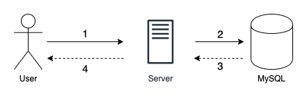
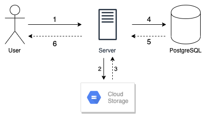
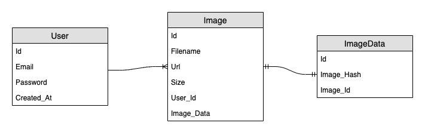

# Architecture for Utsuru Concept

This document describes the various architecture aspects as well as some choices behind the development of Utsuru Concept.

- [Architecture for Utsuru Concept](#architecture-for-utsuru-concept)
  - [High-Level Overview](#high-level-overview)
  - [Technologies](#technologies)
  - [Components Interaction](#components-interaction)
    - [Registration](#registration)
    - [Login](#login)
    - [Upload](#upload)
    - [Search](#search)
  - [Data Entities](#data-entities)
  - [Project Structure](#project-structure)
  - [Potential Bottlenecks and Future Considerations](#potential-bottlenecks-and-future-considerations)
    - [Synchronous Operations](#synchronous-operations)
    - [Limitations of MySQL](#limitations-of-mysql)
    - [Handling of Private Pictures](#handling-of-private-pictures)

## High-Level Overview

Utsuru Concept is a client-server application which offers an API for a client to upload his/her pictures. Since the original task is an open-ended one, the following features have been implemented:

- User registration
- User login
- Image upload (Public)
- Image search based on another image

## Technologies

Below are the core technologies, libraries and services required for Utsuru Concept to work correctly:

- [Go](https://golang.org/) as the programming language
- [Gin](https://gin-gonic.com/) as the web application framework
- [GORM](https://gorm.io/) as an abstration layer for defining data models to a database
- [MySQL](https://www.mysql.com/) as the relational database management system (DBMS)
- [Google Cloud Storage](https://cloud.google.com/storage/) as the file storage service
- [Imagehash](https://github.com/corona10/goimagehash) for perceptual image hashing
- [Bcrypt](https://en.wikipedia.org/wiki/Bcrypt) for password hashing
- [GoMock](https://github.com/golang/mock) for mocking dependencies during unit tests


For the scope of the features mentionned above, most well-known solutions would have also worked just fine. However, I wanted to propose a solution that would be easy/fast to develop and experiment. Also, I wanted a solution that would make it easy to be deployed without breaking the bank. 💸

In this case, [Google Cloud Run](https://cloud.google.com/run) has been used as a platform to host the application. The single binary nature of Go makes it easy to build a Docker image and deploy it in a few instants. As for MySQL, third-party vendors can offer it  as a [free add-on](https://elements.heroku.com/addons/cleardb). Google Cloud also offers free Cloud Storage quotas as part of it's [Always Free](https://cloud.google.com/free/) tier.

A first version of this project was using Python and Flask for Fall 2020 internships.

## Components Interaction

Below are diagrams explaining the flow of the interaction between components in an **successful** scenario.

### Registration



1. The user sends its credentials to the service using the `/api/v1/register` endpoint.
2. The server will then verify against the database if the email exists.
3. If it doesn't exist then, a new user is created and it's password is hashed and saved into the database
4. The client receives confirmation or denial of the user's registration

### Login


1. The user sends its credentials to the service using the `/api/v1/login` endpoint.
2. The server will then verify against the database if the email and the hashed password belongs to a registered user.
3. If the information is valid, a JWT token is generated
4. This token is then returned to the user and he/she must use it for all subsequent requests to the repository

### Upload



1. The user sends his/her image(s) to the `/api/v1/upload` endpoint.
2. The server will then upload the picture to a Google Cloud Storage bucket
3. Upon successfull upload, the Cloud Storage library returns some information about the file like the size or the public link.
4. The server then computes the perceptual hash, and requests to save the image metadata into the database
5. The database successfully saves the data
6. The server returns the data regarding the images that have been saved

### Search


1. The user sends his/her image to the `/api/v1/search` endpoint. The server then computes the perceptual hash of this image
2. The server sends the metadata of the uploaded image to be compared against the database
3. The database returns images that has similar hashes back to the server
4. The server sends back all those images back to the user.

## Data Entities



The image above represents the data entities used for Utsuru Concept as well as their relations. `User` is the representation of a user of the solution, `Image` which represents an image as a file and `ImageData` which is used to represent an image's metadata. For the relations (links):

- One-To-Many relation between `User` and `Image`. In that sense, one user can have many images.
- One-To-One relation between `Image` and `ImageData`. In that sense, one image and only have one set of metadata.

## Project Structure

Due to the open structure of Go, there aren't many guidelines on how to set the directories for a project. As such, the project is based on this [template](https://github.com/vsouza/go-gin-boilerplate). Here is the base structure for Utsuru Concept:

```
UtsuruConcept/
  controllers/
    login.go
    register.go
    router.go
    search.go
    upload.go
  docs/
    images/
      Utsuru_Concept_Erd.png
      Utsuru_Concept_Erd.drawio
      Utsuru_Concept_Registration_Login_Search.png
      Utsuru_Concept_Registration_Login_Search.drawio
      Utsuru_Concept_Upload.png
      Utsuru_Concept_Upload.drawio
  mocks/
    mock_db.go  
    mock_gcs.go
  models/
    db.go
    user.go
    image.go
    imagedata.go
  storage/
    gcs.go
  testing/
    files/
      test_picture.jpg
      test_text.txt
    components.go
    image_test.go
    imagedata_test.go
    login_test.go
    register_test.go
    user_test.go
```

- `models` represents the objects that are to be mapped between the application and the database.
- `mocks` represents the dependencies (for example the database) that have been mocked so it is easier isolate components while testing.
- `controllers` represents the endpoints for the application.
- `storage` represents the data storage components of the application.
- `testing` represents the list of tests used for this validating the features of the application.

For a simple use-case it might be a little over the board to consider these patterns. However, as more features get added to an application, it definitely gets more rewarding to structure the application in a way that enables more flexibility and easier testability.

## Potential Bottlenecks and Future Considerations

### Synchronous Operations

All the operations in Utsuru Concept are synchronous. While, this might not matter much for the registration and login up to a certain point, it will result in long wait times for the user as well as potential overloading on the server during upload and search operations if there are a lot of them using the service. This will result in sub-par user experience.

A solution to this is to adopt asynchronous patterns like a message queue which would have two benefits:

- For the client to return immediately a response to the user so he/she can do another task while the request is being processed.
- To avoid the server being overloaded while processing requests by limiting the number of messages that can be processed at a time.

### Limitations of MySQL

MySQL was considered at first because of its [handy](https://stackoverflow.com/q/14925151) `BIT_COUNT()` function which can be used to compute the hamming distance between picture hashes easily. With that said, this solution might prove itself hard for a relatively big number of pictures. (Multiple users having hundreds/thousands of pictures)

Several solutions could be considered for this situation:

- Use horizontal scaling and [shard the database](https://en.wikipedia.org/wiki/Shard_(database_architecture)) in a way that similar hashes are close to be used. Search time is reduced but this could incur higher costs as a database cluster needs to be managed. Other issues include latency and data consistency.

- Use a tool that is primarily aimed at searching like a [search engine](https://www.elastic.co/app-search/). Issues include usage of a new technology that might not be totally situed for the current usage, thus including more developing time. Also adds complexity to the current technology stack.

- [Optimize](https://stackoverflow.com/a/35069581¼) the SQL queries for image retrieval and potentially use an index to only consider the hashes "close" enough to the wanted picture. This could be a good solution depending on the current situation and growth of the application that is also cost-effective.

### Handling of Private Pictures

Ideally in a photo repository, a user might want to upload his/her pictures without it being available to everybody. In that case, the bucket would be secured so that external acces must not be permitted. However, it should still be possible for the user to see its own picture. In that case, a [Signed URL or a Signed Cookie](https://cloud.google.com/cdn/docs/private-content) can be considered.

- A Signed URL would be used in cases where access is restricted to individual files (Installation executable for example)
- A Signed Cookie would be used where access to multiple files at a time is required.

Creating multiple Signed URLs will take time if several files are used. Furthermore, since they expire after a certain given period of time, a signed cookie might be a better solution. With that said, using them require a [content delivery network (CDN)](https://en.wikipedia.org/wiki/Content_delivery_network) to be configured.