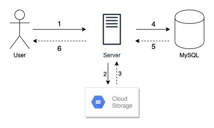

# Architecture for Utsuru Concept

This document describes the various architecture aspects as well as some choices behind the development of Utsuru Concept.

  - [High-Level Overview](#high-level-overview)
  - [Technologies](#technologies)
  - [Components Interaction](#components-interaction)
    - [Registration](#registration)
    - [Login](#login)
    - [Upload](#upload)
    - [Search](#search)
  - [Data Entities](#data-entities)
  - [Project Structure](#project-structure)
  - [Potential Bottlenecks and Future Considerations](#potential-bottlenecks-and-future-considerations)
    - [Synchronous Operations](#synchronous-operations)
    - [Limitations of Postgres](#limitations-of-postgres)

## High-Level Overview

Utsuru Concept is a client-server application which offers an API for a client to upload his/her pictures. Since the original task is an open-ended one, the following features have been implemented:

- User registration
- User login
- Image upload (Public)
- Image search based on another image

## Technologies

Below are the core technologies, libraries and services required for Utsuru Concept to work correctly:

- [Python](https://www.python.org/) as the programming language
- [Flask](https://palletsprojects.com/p/flask/) as the web application framework
- [SQLAlchemy](https://www.sqlalchemy.org/) as an abstration layer for defining data models to a database
- [PostgreSQL](https://www.postgresql.org/) as the relational database management system (DBMS)
- [Google Cloud Storage](https://cloud.google.com/storage/) as the file storage service
- [Marshmallow](https://marshmallow.readthedocs.io/en/stable/) for data serialization/deserialization and validation
- [Imagehash](https://pypi.org/project/ImageHash/) for perceptual image hashing
- [Bcrypt](https://en.wikipedia.org/wiki/Bcrypt) for password hashing


For the scope of the features mentionned above, most well-known solutions would have also worked just fine. However, I wanted to propose solution that would be easy/fast to develop and experiment since this was my _first_ backend project. Also, I wanted a solution that would make it easy to be deployed without breaking the bank. 💸

In this case, [Heroku](https://www.heroku.com/) could be used as a platform to host the application and also includes PostgreSQL as a [free add-on](https://www.heroku.com/postgres). Google Cloud Platorm also offers free Cloud Storage quotas as part of it's [Always Free](https://cloud.google.com/free/) tier.

## Components Interaction

Below are diagrams explaining the flow of the interaction between components in an **successful** scenario.

### Registration


1. The user sends it's credentials to the service using the `/api/register` endpoint.
2. The server will then verify against the database if the email exists.
3. If it doesn't exist then, a new user is created and it's password is hashed and saved into the database
4. The client receives confirmation or denial of the user's registration

### Login


1. The user sends it's credentials to the service using the `/api/login` endpoint.
2. The server will then verify against the database if the email and the hashed password belongs to a registered user.
3. If the information is valid, a JWT token is generated
4. This token is then returned to the user and he/she must use it for all subsequent requests to the repository

### Upload



1. The user sends his/her image(s) to the `/api/upload` endpoint.
2. The server will then upload the picture to a Google Cloud Storage bucket
3. Upon successfull upload, the Cloud Storage library returns some information about the file like the size or the public link.
4. The server then computes the perceptual hash, and requests to save the image metadata into the database
5. The database successfully saves the data
6. The server returns the data regarding the images that have been saved

### Search


1. The user sends his/her image to the `/api/search` endpoint. The server then computes the perceptual hash of this image
2. The server requests the metadata from all the images from the database
3. The database sends the metadata from all the images back to the server
4. The server then compare the hash of the uploaded image against all the images and sends back all the images that are similar to the user.

## Data Entities


The image above represents the data entities used for Utsuru Concept as well as their relations. `User` is the representation of a user of the solution, `Image` which represents an image as a file and `ImageData` which is used to represent an image's metadata. For the relations (links):

- One-To-Many relation between `User` and `Image`. In that sense, one user can have many images.
- One-To-One relation between `Image` and `ImageData`. In that sense, one image and only have one set of metadata.

## Project Structure

The project is based upon this [guide](https://lepture.com/en/2018/structure-of-a-flask-project) on how to structure a Flask project. Here is the base structure for Utsuru Concept:

```
UtsuruConcept/
  app/
    __init__.py
    main.py
    models/
      __init__.py
      user.py
      image.py
      imagedata.py
    routes/
      __init__.py
      register.py
      login.py
      upload.py
    schemas/
      __init__.py
      imageschema.py
      userschema.py
    tests/
      test_login.py
      test_register.py
```

- `models` represent the objects that are to be mapped between the application and the database
- `routes` represents the endpoints for the application
- `schemas` represents the schemas used for validating and serializing data
- `tests` represents the list of tests used for this validating the features of the application.

By using a `create_app()` pattern or Application Factories, we can avoid cyclic dependencies which can be hard to debug when starting off with a new language. 

I agree, for a simple use-case it might be a little over the board to consider patterns like these. However, as more features get added to an application, it definitely gets more rewarding to structure the application in a way that enables more flexibility.

## Potential Bottlenecks and Future Considerations

### Synchronous Operations

All the operations in Utsuru concept are synchronous. While, this might not matter much for the registration and login up to a certain point, it will result in long wait times for the user as well as potential overloading on the server during upload and search operations if there are a lot of users using the service.

A solution to this is to adopt asynchronous patterns like a message queue which would have two benefits:

- For the client to return immediately a response to the user so he/she can do another task while the request is being processed.
- To avoid the server being overloaded while processing requests by limiting the number of messages that can be processed at a time.

### Limitations of Postgres

Although PostgreSQL is available as a free hosted solution from Heroku, it might be an issue when looking for similar images. Indeed the current offering is not very sustainable because for every image compared, the metadata from all the images is retrieved and then compared against the perceptual hash from the user image.

A better solution would be to consider MySQL which offers a native `BIT_COUNT()` function which can be used get a list of images faster. It has been reported that operations have been [75x faster](https://stackoverflow.com/q/14925151) using MySQL compared to Postgres.